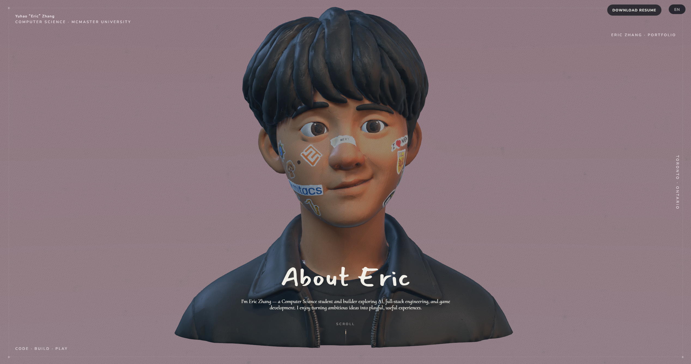

# About Eric — 3D Resume

An interactive, bilingual portfolio for **Yuhao “Eric” Zhang**. Scroll through the site to move through a 3D scene: the camera follows a Blender-authored path, the avatar's eyes follow the cursor, and each resume section has its own cinematic focus point.

> Built for roles across AI, full-stack engineering, and game development.

## Preview



## Highlights

- Scroll-driven 3D camera animation, authored in Blender and rendered with React Three Fiber
- Custom cartoon avatar with animated eyes and face stickers
- English / Chinese public portfolio experience
- Supabase-powered admin area for maintaining bilingual resume and project content
- Responsive React + TypeScript + Vite single-page app
- Automatic GitHub Pages deployment on every push to `main`

## Live site

After GitHub Pages is enabled, the site is available at:

`https://dormiveglia1.github.io/3d-resume/`

## Run locally

```bash
cd web
npm install
npm run dev
```

Open the local URL printed by Vite (usually `http://localhost:5173`).

Other useful commands:

```bash
npm run build      # Type-check and make a production build
npm run preview    # Preview the production build locally
npm run lint       # Run ESLint
```

## Content management

The public experience is at `/`. The admin area is at `/admin` and uses Supabase passwordless email authentication.

Create `web/.env.local` locally (never commit it):

```env
VITE_SUPABASE_URL=https://your-project.supabase.co
VITE_SUPABASE_ANON_KEY=your-publishable-key
```

Then apply the SQL migrations in [`web/supabase`](web/supabase) through the Supabase SQL Editor, add your authenticated user to `admin_users`, and configure the allowed redirect URL for local development and the deployed Pages URL.

For GitHub Pages, add these two **Repository secrets** in **Settings → Secrets and variables → Actions** before deploying:

- `VITE_SUPABASE_URL`
- `VITE_SUPABASE_ANON_KEY` (paste the Supabase **Publishable key**)

The site receives these browser configuration values at build time. Actions secrets keep them out of repository files and commit history.

The admin area maintains Chinese and English versions of both the camera-linked resume stops and Works content. New resume stops need a corresponding `focus-*` empty and camera keyframe in Blender; Works entries do not require new 3D nodes.

## 3D model contract

The web model is [`web/public/models/eric-resume-optimized.glb`](web/public/models/eric-resume-optimized.glb). It must retain:

- `CameraAction` — camera animation clip
- `focus-0` through `focus-5` — hero and resume anchors
- `focus-works` — optional works anchor
- `eye_L` and `eye_R` — separate eye objects for cursor tracking

The production model has been decimated in Blender to keep page delivery practical. Keep Blender source and high-resolution exports outside `web/public/models`.

## Deploy with GitHub Pages

The workflow in [`.github/workflows/deploy.yml`](.github/workflows/deploy.yml) installs dependencies, builds `web/`, and deploys `web/dist` whenever `main` is updated.

In the GitHub repository, set **Settings → Pages → Build and deployment → Source** to **GitHub Actions** once. Every later push to `main` deploys automatically.

Also add `https://dormiveglia1.github.io/3d-resume/admin` to **Supabase → Authentication → URL Configuration → Redirect URLs** so passwordless admin login can return to the deployed site.

## Tech stack

React · TypeScript · Vite · Three.js · React Three Fiber · Drei · Framer Motion · Zustand · Supabase · Blender

## Credits and license

This is Eric Zhang’s independent portfolio implementation and personal content. Its codebase was adapted from the MIT-licensed [sen-3d-resume](https://github.com/dayinji/sen-3d-resume) project; the required upstream copyright notice is retained in [`LICENSE`](LICENSE). All original personal assets, examples, and tutorial material have been removed and replaced. Third-party logos, brand assets, and linked project materials remain the property of their respective owners.
